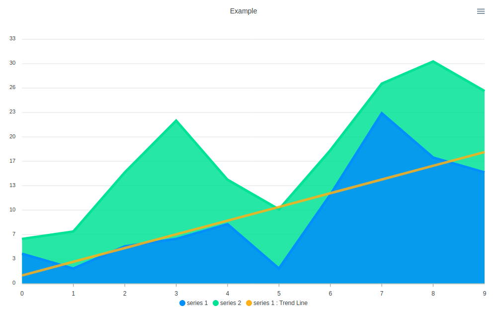

# Vue Apexcharts Trendline

vue-apexcharts component for adding a trend line to your charts.
This component uses linear regression to calculate the trend line. 

## Installation

Installing via npm

```bash
npm install vue-apexcharts-trendline
```
    

## Properties

* type: 
    * The chart type used for the main series. See [docs](https://apexcharts.com/docs/installation/) for more information.
    * default: 'area'
    
* options: 
    * The options to be used for the chart. See [docs](https://apexcharts.com/docs/installation/) for more information.
    * default: (uses the ApexCharts defaults)
    
* series: 
    * The series to be used. [docs](https://apexcharts.com/docs/installation/) for more information.
    * *required
    * format: [{name: ..., type: ..., data: ...}, ...], The ``` type ``` property is important for stacked charts.
    
* trend-options: 
    * Object containing various options used be the component.
    * properties: 
        * text: The text string to append the the series name for the trend line series.
        * indices: The indices to be used for trend lines, if you don't want to use all the series.
        * series: An option to set a different series for creating the trend lines, if different from main series.
        * show: Determines if the trend lines should be shown or not.
        * tooltips: Determines whether or not to display tooltips of trend lines.
        * dataLabels: Determines whether or not to display dataLabels of trend lines.
        * combined: Determines whether or not to combine the series for the trend line. If not set and options.chart.stacked is true, then it will combine. 
    * defaults: 
        * text: 'Trend Line'
        * indices: undefined
        * series: undefined
        * show: true
        * tooltips: false
        * dataLabels: false
        * combined: undefined
        
## Example

This is a basic example show how to us the component in a single file vue component. 

 ```vue
<template>
    <div id="trend-line">
        <vue-apexcharts-trendline :type="type" :options="options" :series="series" :trend-options="trend_options"/>
    </div>
</template>

<script>
    import VueApexchartsTrendline from "vue-apexcharts-trendline";

    export default {
            name: 'ExampleChart',
            components: {
                VueApexchartsTrendline,
            },
            data() {
                return {
                    series: [{
                        name: 'series 1',
                        type: 'area',
                        data: [
                            {x: 0, y: 4},
                            {x: 1, y: 2},
                            {x: 2, y: 5},
                            {x: 3, y: 6},
                            {x: 4, y: 8},
                            {x: 5, y: 2},
                            {x: 6, y: 12},
                            {x: 7, y: 23},
                            {x: 8, y: 17},
                            {x: 9, y: 15},
                        ],
                    }, {
                        name: 'series 2',
                        type: 'area',
                        data: [
                            {x: 0, y: 2},
                            {x: 1, y: 5},
                            {x: 2, y: 10},
                            {x: 3, y: 16},
                            {x: 4, y: 6},
                            {x: 5, y: 8},
                            {x: 6, y: 6},
                            {x: 7, y: 4},
                            {x: 8, y: 13},
                            {x: 9, y: 11},
                        ],
                    }],
                    options: {
                        title: {
                            text: 'Example',
                            align: 'center',
                        },
                        chart: {
                            stacked: true,
                        },
                    },
                    type: 'line',
                    trend_options: {
                        indices: [0],
                        combined: false,
                    },
                };
            },
        };
</script>

```



## Notes 

* When using stacked charts the component recalculates the "yaxis.max" value as the trend lines increase the value.
* When using stacked charts with "{trend-options}.combined = false", the trend lines are also stacked.
* The component also rounds all y axis labels with "Math.round()"